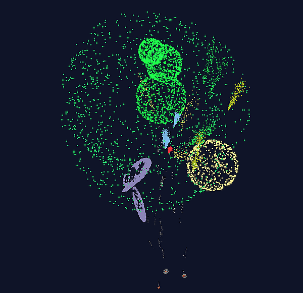

# Task 08-Fireworks
Your task is to implement a **simulation of fireworks** using a 3D **particle system**.
Individual particles (flying rockets, sparks, flares) should obey the **laws of physics**
(gravity and air resistance), but you do not have to worry about their mutual
interactions or collisions.

The entire 3D scene (fireworks) must be rendered interactively using the
[OpenGL library](https://www.opengl.org/) bound to the .NET through the
[Silk.NET library](https://github.com/dotnet/Silk.NET).

# Ideas & Details
* **Gravity** is a constant force pointing downwards (g=9.81 m/s^2)
* **Drag vector** is pointing against the current velocity - [Wikipedia page](https://en.wikipedia.org/wiki/Drag_(physics))
  ([more simple Czech version](https://cs.wikipedia.org/wiki/Odpor_prost%C5%99ed%C3%AD)).
  You can experiment with coefficients but basic **laminar (linear)** +
  **turbulent (quadratic)** formula will suffice
* The concept **"launchers + particles"** is recommended
* **Launchers** are points or areas where new particles are created
  - Launchers don't need to be visible (but you can render them for bonus points)
* **Particles** have obvious physical/appearance attributes plus simulation-logic
  related quantities
  - current **position** (`Vector3`)
  - current **velocity** (`Vector3`)
  - current **RGB color** (`Vector3`)
  - **age** in seconds (`float` or `double`) to simulate aging and demise
  - **inner state** of the particle (anything you need for proper simulation)
  - **mass** could be constant (`float`)
  - **drag coefficients** could be constant (`float[]`)
* Particles **need not** interact with each other
* **Discrete time simulation** approximates an actual continuous spacetime by using a short
  period of time (**delta-t**, `dT` in seconds) to simplify the simulation
  - `dT` could be the time between two successive rendered frames
    (i.e. 1/60 of the second or so) 
  - We assume that during the simulation step (`dT`) the values of some
    quantities **remain constant** (although this is not actually true). Velocity
    vector (~drag vector)...
  -	This is called **"Euler method"** for solving differential equations
    [see the Wikipedia page](https://en.wikipedia.org/wiki/Euler_method).
    Higher order methods (like
    [Runge-Kutta](https://en.wikipedia.org/wiki/Runge%E2%80%93Kutta_methods)) are not necessary.
  - Just a reminder how basic mechanic simulation works:
    1. determine all the **forces** active during the simulation step/interval (gravity, drag)
    2. compute the **total acceleration** (`Vector3`) from the forces
    3. apply the acceleration to the current position and velocity - compute the
       **new position and velocity**
       (you can use a little bit smarter formula for that, using the idea of
       [uniform acceleration](https://en.wikipedia.org/wiki/Acceleration))
    4. that's it for the **mechanics**, now you should update color, age, inner state...
       accordingly
* You should manage the reasonable **number of current particles** in the
  system by modulating the creation rate in launchers and/or changing the
  particle life span.
* Launchers should be active **during every simulation step** (`dT`) to add new
  particles into the system (trying to dilute the addition of new particles).
  This will make the simulation steps less obvious.

## Rendering
Use of point primitives (`GL_POINTS` in plain OpenGL, `PrimitiveType.Points` in Silk.NET)
is recommended. You can use point color and size to get better visualization.

It makes no sense to use **Index buffers** (`Gl.DrawElements()`) to draw points,
you should call `Gl.DrawArrays()` instead.

You should keep the coordinates of all the simulated particles in one large
**vertex buffer** (`VB`). Don't complicate you implementation too much - there
could be a secondary array `List<struct Particle> Particles`(usig the same
indices as the `VB`) to describe the set of particles. `VB` will be used
for rendering, `Particles` for everything else. **Don't read** from GPU's copy
of vertex buffer, just update it using `Gl.BufferSubData()` calls (the process could
be summarized as **"Simulate - UpdateVB - Render"**).
The only complication arises when a particle **retires**. You should either reuse
its index immediately or come up with some mechanism to tell the vertex
shader to avoid that vertex...?

No special **fragment shader** is required, you can only change it in case of
advanced appearance improvements.

# Sil.NET framework
It is easy to use the [Silk.NET](https://github.com/dotnet/Silk.NET) in your C#
program, you just install the [Silk.NET NuGet package](https://www.nuget.org/packages/Silk.NET/).

You can view our sample projects in the
[Silk3D directory](../Silk3D/README.md) of our repository.

# Pilot project
There is a pilot project in this GIT directory. We wanted to show a working
OpenGL ([Silk.NET](https://www.nuget.org/packages/Silk.NET/)) project with

- `Silk.NET.Windowing.Window`-based main program
  - window title is used for simple real-time status (see `Program.WindowTitle()`)
- command-line arguments
  - `-w`, `-h` - initial window size in pixels
  - `-p` - maximum number of particles in the system (see details later)
  - `-r` - particle generator rate (number of generated particles in one second,
    could be changed later using the keys `Up` and `Down`)
  - `-t` - optional texture file (default is `:check:` = checkerboard)
- console window is kept for simple messaging (`Util.Ut.Message()`)
- [Trackball](../Silk3D/support/Trackball.cs) support
- `class Util.FPS` is used for measuring FPS (Frames Per Seconds) and PPS
  (Primitive Per Second)
  - try switching "Vertical synchronization" (VSync) on and off (key `V`)!
- **keyboard** and **mouse** event handling (including simple help `F1`)
  - `KeyDown()`, `KeyUp()` for the keyboard
  - `MouseDown()`, `MouseUp()`, `MouseDoubleClick()`, `MouseMove()`, `MouseScroll()`
    for the mouse
- simulation and rendering of simple **particle system**
  - `Particle` is a **point** in 3D (position, color, age, size - 
    you'll need more attributes for a fireworks!)
  - `Simulation` is the whole particle system, responsible mainly for particle
    management (creating, destroying)

## Simulation
The discrete time simulation function `SimulateTo()` is called from the `OnRender()` function.
So one simulation step is called for each rendered frame.

The particle data is updated every frame with the `GL.BufferSubData()` function. So every frame
the whole particle system is updated (`SimulateTo()`) and then the whole vertex buffer
is updated (`FillBuffer()`) and rendered.

**Simulation logic**: the simulation manager (`class Simulation`) tries to keep the
number of particles as close to `Simulation.MaxParticles` as possible. If some
particles are retired, new ones are created.

Each `Particle` has an age, initialized to the lifespan value at the beginning.
The size and color of a particle changes according to its age. Please be inspired by this
and use a mechanism that fits your fireworks logic.

One more **warning** - the logic of your fireworks simulator should be different, you
just don't want to exceed the **maximum number of particles** (as this would cause the
vertex buffer to overflow).

### Functions `SimulateTo(double time)`
Simulates the entity (the whole particle system or individual `Particle`) until the desired time.
The time in seconds is represented as a `double` value throughout the implementation.
`Particle.SimulateTo()` has one more purpose - it returns `false` in case the particle
is being retired and needs to be removed from the system.

The pilot version of the `Particle.SimulateTo()` function is very simple. I just rotate
the particles around a globally defined common axis. Each particle has its own position, rotation
speed and color generated at creation time. Your **simulation logic** must be more
complicated!

### Functions `FillBuffer(float[] buffer, ref int i)`
Every time a parent system needs to update a vertex buffer, this function is called.
It is supposed to fill **exactly** `VERTEX_SIZE` floats into the given `float[]`
array with the index `i` (the index value must be incremented!).
In our example, **12 floats** represent one particle
(`x, y, z, R, G, B, Nx, Ny, Nz, s, t, size`).

### Vertex shader `vertex.glsl`
Note that one of the first things in the shader file is the definition of
input quantities = vertex attributes. **It must match** the previously mentioned
layout of the vertex buffer.
```glsl
layout (location = 0) in vec3 vPos;
layout (location = 1) in vec3 vColor;
layout (location = 2) in vec3 vNormal;
layout (location = 3) in vec2 vTxt;
layout (location = 4) in float vSize;
```
**Uniforms** - the shader requires three transformation matrices.
They are applied to a vertex position in the following order
```glsl
uniform mat4 model;
uniform mat4 view;
uniform mat4 projection;
```
**Output values** - they should be in sync with the **input values of the fragment shader**.
Note that `fWorld` is the original world space coordinates (before the "view" and
"projection" transformations) for shading (I know, shading is not a big deal
in Fireworks but you do not need to turn it on).
```glsl
out vec3 fColor;
out vec2 fTxt;
out vec3 fNormal;
out vec4 fWorld;
```
The last note is about **"built-in" output variables**. We are using two of them,
`gl_Position` (`vec4`) and `gl_PointSize` (`float` - point size in pixels).

See the [vertex.glsl](vertex.glsl) shader yourself if you are interested.

### Fragment shader `fragment.glsl`
Fragment shader is used for coloring the fragments (pixels).
Our shader has optional texturing (`texture()`) and optional Phong shading
(actually most of the shader code).

Note that the output value is explicitly declared in the shader
```glsl
out vec4 FragColor;
```
The reason for this is the ability to use either `vec3` (RGB) or `vec4`
(RGBA).

See the [fragment.glsl](fragment.glsl) shader yourself if you are interested.

# Your solution
Please place your solution in a separate [solutions](solutions/README.md)
directory in the repository. You'll find short instructions there.

# Launch date
**Monday 11 December 2023**
(Don't work on the solution before this date)

# Deadline
See the shared [point table](https://docs.google.com/spreadsheets/d/1QLukOcSRPa5exOYW1eUfQWY2WoMjo1menbjQIU7Gvs4/edit?usp=sharing).

# Credit points
**Basic solution: 10 points**
* Working interactive fireworks simulation
  - The particles must move according to the **laws of physics** (so that no disturbing
    deviations are visible at first glance)
  - The particles must have a **lifetime limit** so that the simulation
    system is not overloaded (the simulation must be able to run for several minutes)
* The entire 3D scene is interactively viewed by the user using the [Trackball system](../Silk3D/shared/Trackball.cs)

**Bonus points: up to 14+ more points**
* Animation of launch ramps
* Multiple rocket/particle types
* Multi-stage explosions
* Color/point-size changes during life of a particle/rocket...
* Visualization of rocket trajectories
* Interactive fireworks control (mouse, keyboard). Launcher fire trigger
* Advanced shading effects, etc.

## Use of AI assistant
It is possible to use an AI assistant, but you have to be critical and
test all its suggestions thoroughly.

# Images

